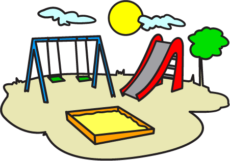

.. qm_playground documentation master file, created by
   sphinx-quickstart on Wed May  4 16:36:17 2016.
   You can adapt this file completely to your liking, but it should at least
   contain the root `toctree` directive.

Welcome to qm_playground's documentation!
=========================================

Contents:

.. toctree::
   :maxdepth: 2

   Introduction <intro>
   Features <features>
   Visualisation <visualisation>
   Examples <examples>
   qmp Modules <qmp>

Indices and tables
==================

* :ref:`genindex`
* :ref:`modindex`
* :ref:`search`

